# 虚拟DOM与Diff算法

## 打补丁的步骤

打补丁过程大致分为5个步骤：

1、创建虚拟DOM

2、根据虚拟DOM得出真实DOM

3、将真实DOM挂载到页面上

4、通过对比旧的虚拟DOM与新的虚拟DOM，生成一个patch补丁包

5、给真实DOM打补丁

__注意这里整个过程都是深度优先遍历的__

## 虚拟DOM结构

虚拟DOM节点由createElement()方法创建的，可以看到createElement()方法接受三个参数，第一个是标签名，第二个是描述元素拥有的属性的对象，第三个是节点的子节点，是一个数组。

## 第一步创建虚拟DOM

可以看到我们是通过createElement()方法来创建虚拟DOM。createElement()方法在virtualDom.js文件中：

其实就是把虚拟DOM节点信息存到element实例中

## 第二步根据虚拟DOM生成真实DOM

可以看到这里通过render()方法将虚拟DOM转换成真实DOM rDom

在render()方法中，__主要是做了三件事 1、通过document.createElement()创建DOM元素 2、处理props，给DOM元素添加属性 3、处理children，递归处理子节点。__其实就是document.createElement()来创建虚拟DOM中type的标签，然后遍历props来给DOM添加属性。如果这个节点有children，也就是有子节点，就遍历，判断到如果节点是元素节点就继续调用render()方法来处理，如果是文本就创建文本节点，最后appendChild()到节点上，最后把真实DOMreturn出去。其实这里面就是通过递归来一层层地处理节点：

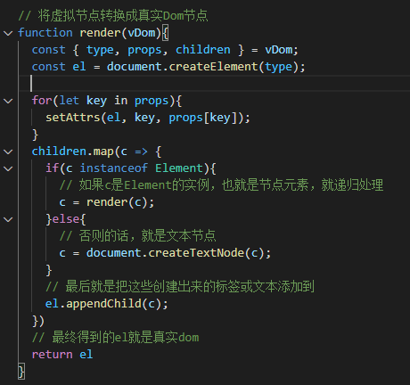

这里可以看下是如何通过setAttrs()方法来给元素添加属性的，在DOM操作中，一般给DOM添加属性的方法就是用dom.setAttribute(key, value)。这里主要是考虑两个特殊的属性：1、value 2、style。如果是value的话，给input/textarea添加value的方法是input.value = 'xxx'，而不是setAttribute()；如果是style属性，就通过dom.style.cssText = 'xxx'来设置：

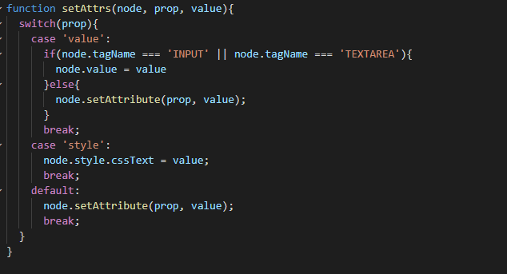

## 第三步把真实DOM挂载到页面上

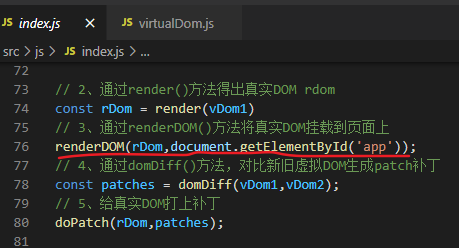

renderDOM()方法很简单，就是给id='app'的DOM添加元素rDOM：

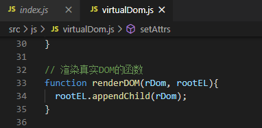

## 第四步通过对比新旧虚拟DOM，生成patch补丁包

这里做的事情就是判断四种情况：1、节点属性的更改 2、节点更替 3、节点删除 4、文本节点的修改，然后通过不同方法来添加补丁

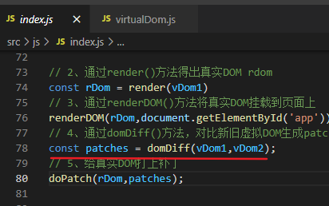

先看一下我们的补丁的结构是这样的。就是一个对象，key可以看作是每个节点的唯一id，然后value是一个数组，数组里面每个对象就是更改了的内容，type表示更改的类型，ATTR表示更改节点、TEXT表示更改文本、REMOVE表示删除节点、REPLACE表示更替节点。

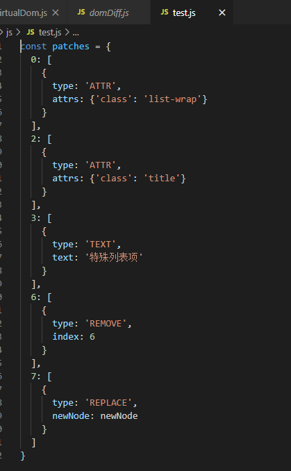

我们要先定义一个patches对象和一个vnIndex，patches对象就是最后我们得出的补丁包，而vnIndex就是dom的唯一id。在domDiff()方法中我们先定义一个其实的index为0，然后走vNodeWalk()方法处理，最后把补丁包patches返回出去。

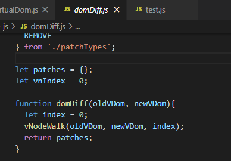

在vNodeWalk()方法中先定义一个数组vnPatch作为这个节点更改的内容。然后就是通过一个个的判断来给vnPatch添加内容，也就是得出更改的部分。第一步就是判断有没有新的节点，如果没有，就是一个删除节点的更改了，type为REMOVE；第二步就是判断旧节点与新节点是不是都是字符串，如果是代表是文本节点的内容更改，type为TEXT；第三步是判断如果两个节点标签名一样，也就是修改了属性了，type为ATTR，如果有children就通过childrenWalk方法递归处理；第四步就剩下更替节点了，type为REPLACE。最后如果vnPatch的长度大于零，代表这个节点有东西更新了，就添加到patches对象中：

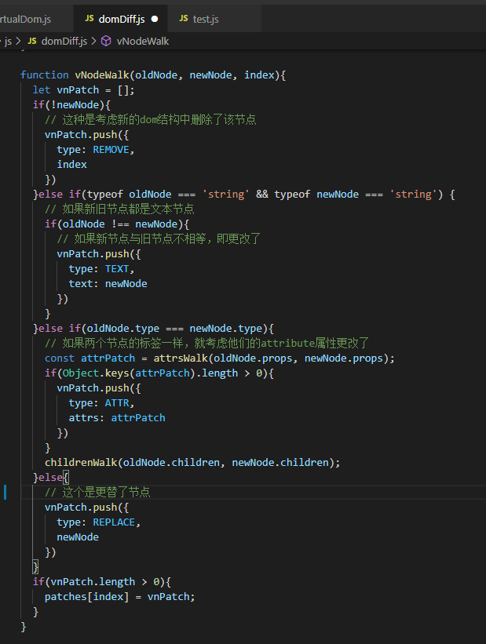

这里看下是如何处理新旧虚拟DOM节点属性的变化的。思路也比较简单，先定义一个空对象，然后遍历旧DOM的节点，考虑两种情况：1、修改属性 2、添加了属性。第一种情况就是判断新旧DOM的节点是否相等；第二种情况就是遍历新DOM的属性然后判断旧DOM的属性的名是否在新DOM中

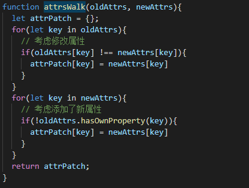

## 第五步给真实DOM打上补丁

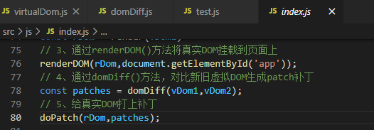

这里是通过index来获取到节点对应补丁，然后递归处理子节点，最后就是如果有对应的补丁，就通过patchAction()方法来打补丁：

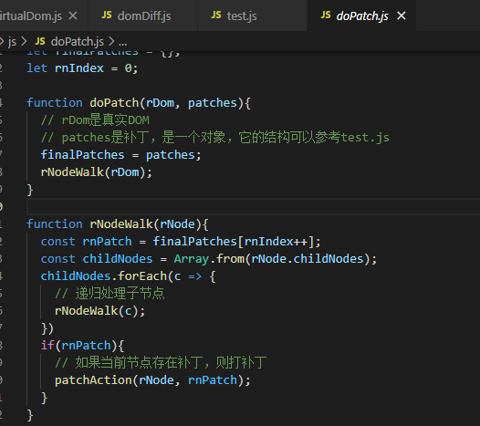

这里看下patchAction()是如何给真实DOM打补丁的：

我们知道每个节点的patch补丁都是一个数组，那么我们可以通过遍历数组每个元素，来判断他们的type也就是修改类型，来做出不同的DOM操作。如果是ATTR就是修改节点属性，如果有属性值，就利用生成真实DOM时的方法setAttrs()来添加属性，如果没有，节点就removeAttribute()移除属性；如果是TEXT，就直接给节点的textContent赋值为text值；如果是REPLACE替换节点，就判断节点是标签节点还是文本节点，如果识标签节点就用render()方法来生成真实DOM，如果识文本节点就用createTextNode()创建文本节点最后用DOM操作replaceChild()替换节点；如果是REMOVE就用DOM操作removeChild()移除节点了。最后就把整个DOM更新完