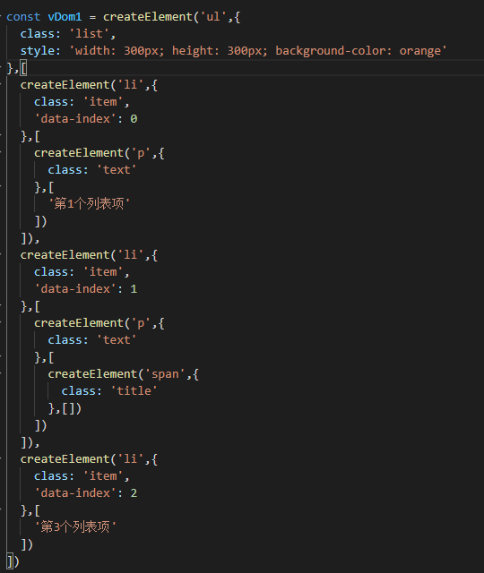
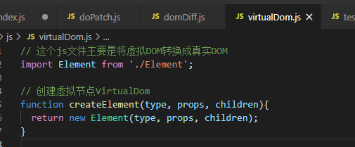

# 虚拟DOM与Diff算法

## 打补丁的步骤

打补丁过程大致分为5个步骤：

1、创建虚拟DOM

2、根据虚拟DOM得出真实DOM

3、将真实DOM挂载到页面上

4、通过对比旧的虚拟DOM与新的虚拟DOM，生成一个patch补丁包

5、给真实DOM打补丁

## 虚拟DOM结构

虚拟DOM节点由createElement()方法创建的，可以看到createElement()方法接受三个参数，第一个是标签名，第二个是描述元素拥有的属性的对象，第三个是节点的子节点，是一个数组。

## 第一步创建虚拟DOM

可以看到我们是通过createElement()方法来创建虚拟DOM。createElement()方法在virtualDom.js文件中：

其实就是把虚拟DOM节点信息存到element实例中

