本视频讲解来自尚硅谷Vue核心视频


# Vue原理解析

## 数据代理

1、数据代理：通过一个对象代理另一个对象中属性的操作（读/写）

2、Vue数据代理：通过vm对象来代理data对象中所有属性的操作

3、好处：更方便的操作data中的数据

4、基本实现流程

- 通过`Object.defineProperty()`给vm添加与data对象的属性相对应的属性描述符
- 所有添加的属性都包含`getter`和`setter`
- `getter`和`setter`内部去操作`this._data`（其实就是配置选项的data）中对应的属性数据


__实现：__

1、在`mvvm.js`中，构造函数`MVVM`先对`data`中的所有`key`进行一个遍历，且通过`Object.defineProperty()`来用`vm`实例代理`data`对象。其实实质就是通过`Object.defineProperty()`来给`vm`实例添加`data`中的所有属性

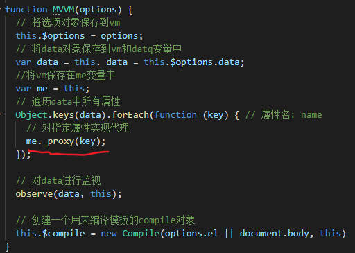


这个`this`就是`vm`实例，当我们通过`vm`实例直接去读/写`data`中的属性时，其实操作的是`vm._data`中的属性

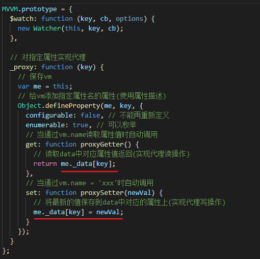

> 在开发中之所以可以通过this来直接访问data中的属性，就是因为这里做了数据代理，给this（vm实例）添加了data中的所有属性

__问题：__

- 问：为什么要数据代理？

  答：因为不实现数据代理，在实际操作中要获取`data`对象中的属性将会很麻烦，应该是要通过`this._data.XXX`这样来获取，显得十分冗余；而实现数据代理之后，因为`vm`实例代理了配置选项`data`对象，`this.XXX`其实就是访问`data`中的`XXX`属性，直接可以通过实例访问`data`中的属性。

__小结：__

- 实现数据代理过程不是很复杂，主要是通过`Object.defineProperty()`来给实例`this`添加`data`中的所有属性。当我们通过`this.XXX`访问属性时就会触发`get()`方法，`get()`方法里返回的是`this._data`中的`XXX`；而通过`this.XXX`修改`XXX`的值时，触发`set()`方法，`set()`方法中修改的也是`this._data.XXX`的值。

  ```
  defineReactive(vm,key,value){
  	// vm是vm实例
  	// key是data中的key
  	// value是data中的key对应的值
  	Object.defineProperty(vm,key,{
  		get(){
  			return vm._data[key];
  		}
  		set(newVal){
  			if(newVal === value)return;
  			this._data[key] = newVal;
  		}
  	})
  }
  ```

  


## 模板解析

__模板解析基本流程：__

1、将el所有子节点取出来，添加到一个新建的fragment对象（文档碎片）中

2、对fragment中所有层次的子节点递归进行编译解析处理

- 对表达式文本节点进行解析（Mustache语法）
- 对元素节点的指令进行解析（v-xxx）
  - 事件指令解析
  - 一般指令解析


__实现：__

1、在`MVVM.js`文件中可以看到把`new Compile()`赋值给`this.$compile`，也就是创建一个用来编译模板的compile实例对象

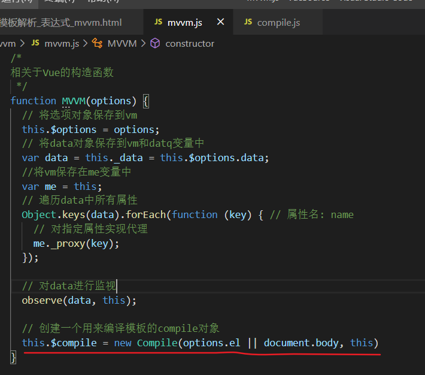


2、这一步主要是将el中的所有子节点取出到文档碎片fragment中（减少dom操作，减少性能消耗），然后初始化，也就是编译模板，赋值给模板中的data属性，最后就是将带有数据的文档碎片append到el根节点中


第一步是调用node2Fragment()方法，通过通过while来判断el是否有第一个子节点，如果有就把这个节点append到fragment对象中，最后返回fragment，__这里注意：通过appendChild把节点添加到fragment后，这个节点是会在真实dom中消失的，所以可以用el.firstChild来一直把真实dom的节点添加到fragment__

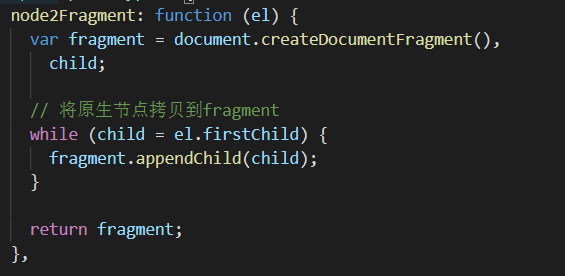


第二步 真正的编译模板，也就是把数据添加到模板中

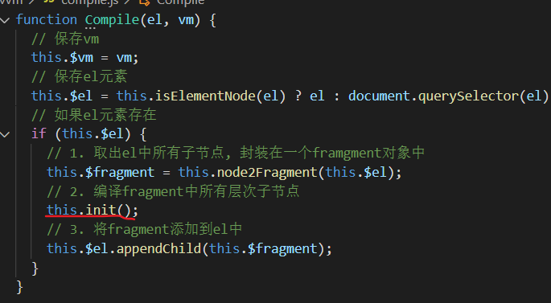

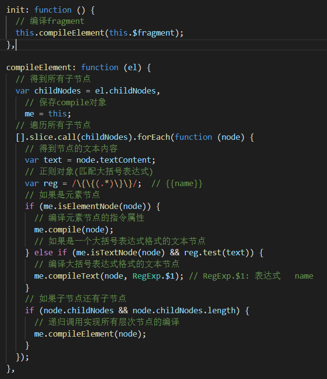


这里面主要是通过`childNodes`来获取`el`根元素里面的所有子节点。通过判断节点类型来进行编译处理，如果节点是元素节点，就会编译元素节点的指令；如果节点是文本节点且是`{{XXX}}`这样的形式，就会编译大括号文本，最后再判断该节点是否有`childNodes`，如果有就递归调用`compileElement()`方法，从而实现把el根元素的所有层次的节点编译。


_1) 解析Mustache语法_

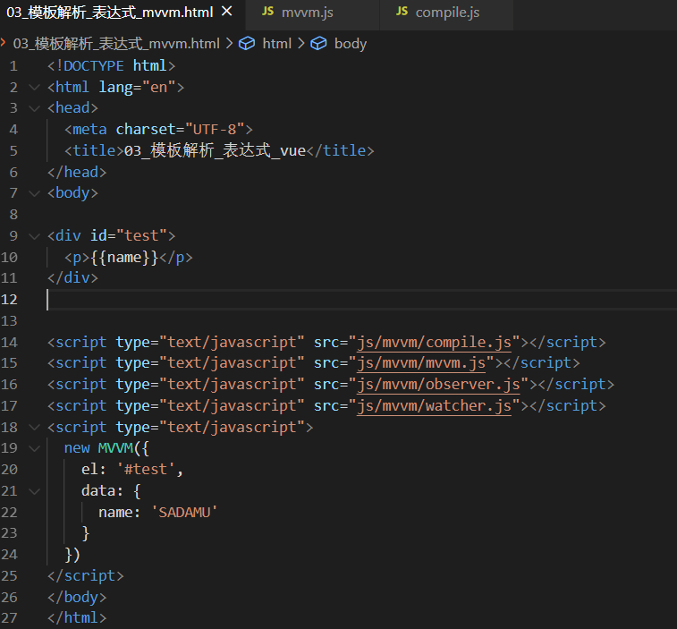


在调用`compileElement()`方法时，拿到`id`为`test`的`div`的第一层`childNodes`，一共三个：换行、p标签、换行。在判断到p标签还有`childNodes`（`{{name}}`文本）时，递归调用`compileElement()`方法，此时通过第一个`else if`判断，调用`compileText()`方法。

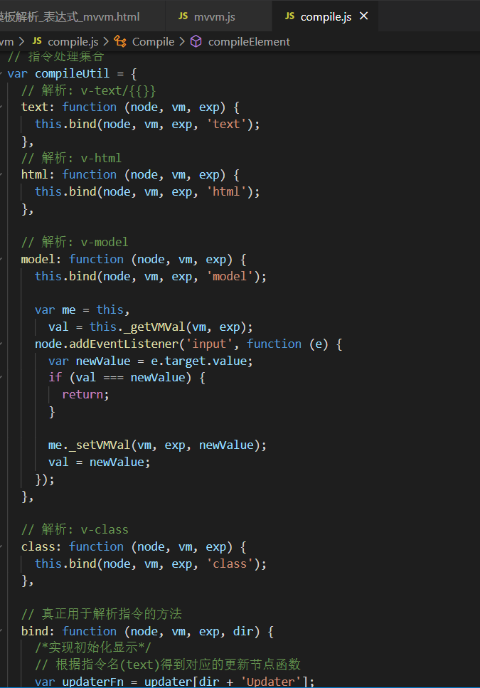

留意这个`compileUtil`对象中都是一些Vue中的指令，所以很明显`v-text`指令和`{{}}`大括号不止实现的效果一样，连实现的方法也是一样的。根据指令名（这里是text）得到对应的更新节点函数，然后调用更新：

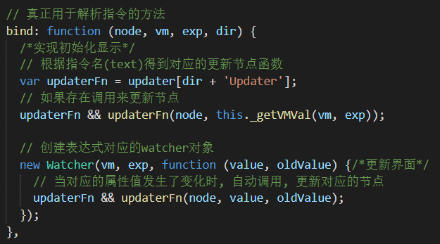

这里有个_getVMVal()方法，目的是获取到exp在data中的属性值：

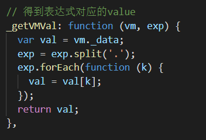

有了节点，有了{{}}中的值，就可以进行更新模板数据了：


这样，{{name}}就会被替换成data中name的值了，也就是SADAMU。完成Mustache语法的解析。


2) _解析指令_

解析指令又分为__事件指令解析__和__一般指令解析__

- 事件指令解析：

  简单来说，就是通过`attributes`获取元素的所有属性，然后判断这些属性是否为事件指令（v-开头且v-后接on），如果是事件指令，则通过`addEventListenr()`来给元素添加事件处理回调

  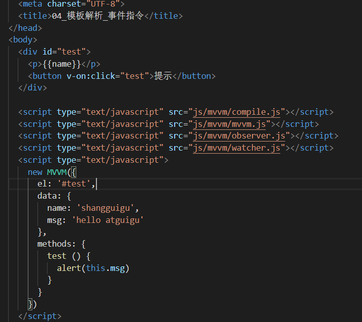

  

  判断到节点是元素节点，进入`compile()`方法：


​		整个`compile()`方法就是用来编译指令的，里面需要判断指令为事件指令还是一般指令：

​                           		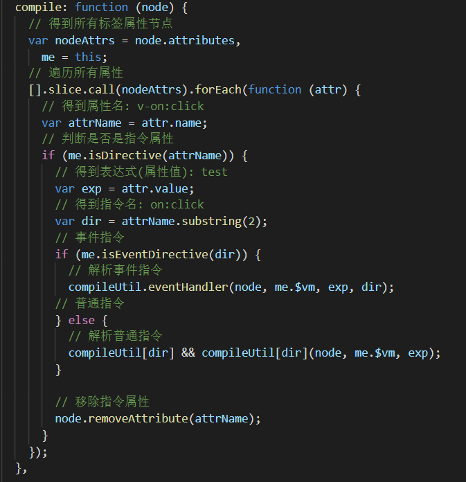

​		这里判断到事件指令`v-on:click="test"`，并且调用`compileUtil.eventHandler()`，而`eventHandler()`内部其实就是通过`adeventListener()`给DOM添加事件监听：

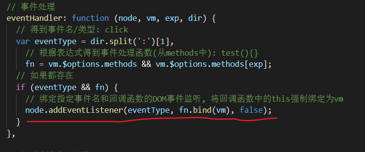

​		至此完成了事件指令的编译。


- 一般指令解析：

  其实是跟解析Mustache语法差不多的。过程思路一样，只是中间一些处理函数不一样


第三步是把添加了数据的模板（文档碎片fragment）添加到el根元素上，__注意：fragment其实相当于vue中的<template>标签，也就是说这个文档碎片相当于一个容器，而不是一个真实的标签，不会添加到真实dom上的，只会添加里面的内容__

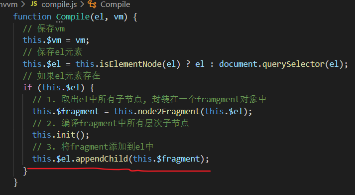


## 数据绑定

__一旦更新了data中某个属性的值，所有界面上直接或间接使用到该属性的节点都会更新__


### 数据劫持

1）数据劫持是Vue2.x中用来实现数据绑定的技术

2）基本思想：在Vue2.x中通过Object.defineProperty()来监视data中所有层次的属性的变化，一旦变化就去更新页面

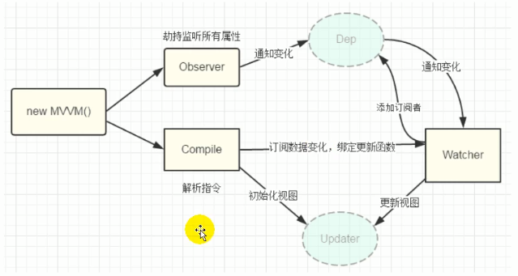

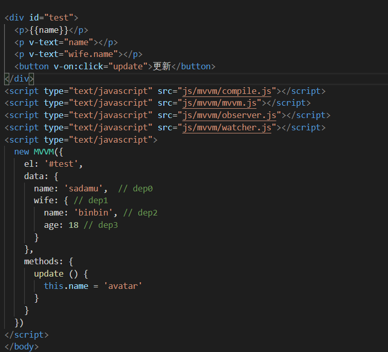


__实现：__

#### Object.defineProperty()给属性添加getter/setter

1、在`MVVM.js`中调用了`observe()`方法，实现数据劫持：

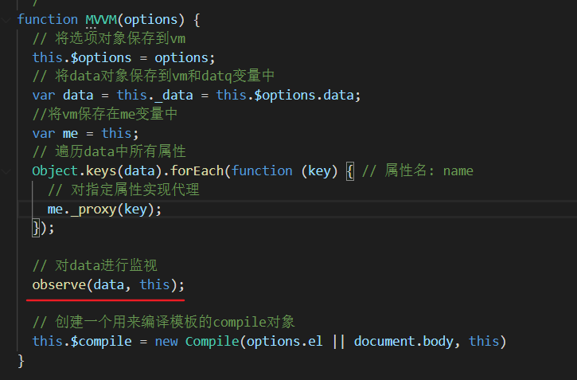

进入`observe()`方法之后，就是通过`Object.keys()`获取到`data`中第一层的属性然后forEach遍历去调用`defineReactive()`，这个`defienReactive()`内部就是一个实现数据劫持的重要方法：

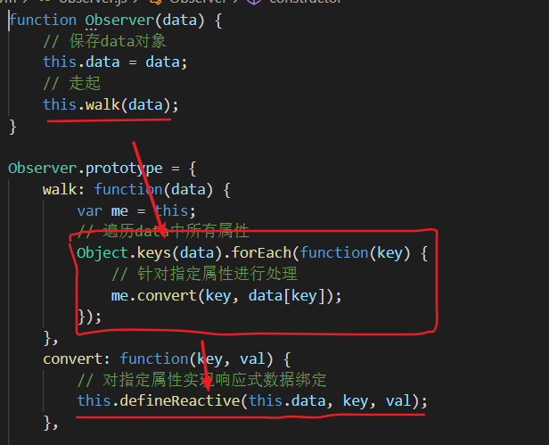

#### 创建dep实例

`defineReactive()`内部是创建一个dep实例（与data属性一一对应），然后通过`Object.defineProperty()`给data属性添加get/set方法。


好，这里先停一下。我们先看下下面这一个过程：

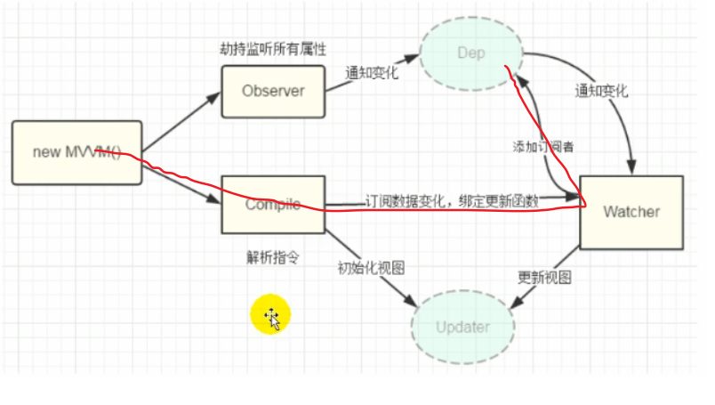

#### 创建watcher实例

这个过程就是在编译模板的时候，给插值或指令添加上唯一的watcher订阅者，然后再把watcher加入到dep里面。__这里其实就是给data中的属性跟页面更新建立起了关系__，而watcher就是他们的中介，我们在编译模板的时候就给插值或指令和watcher添加了对应关系，watcher调用updaterFn方法的时候就会更新页面，而watcher后续又会添加到dep中，dep是跟data中的属性一一对应的，__如果这个属性值发生变化，就会让这个属性的dep通知里面的所有watcher调用updaterFn方法去更新页面。__

`Compile`到`Watcher`这个过程，其实是在`compile.js`的`bind`方法中进行的：

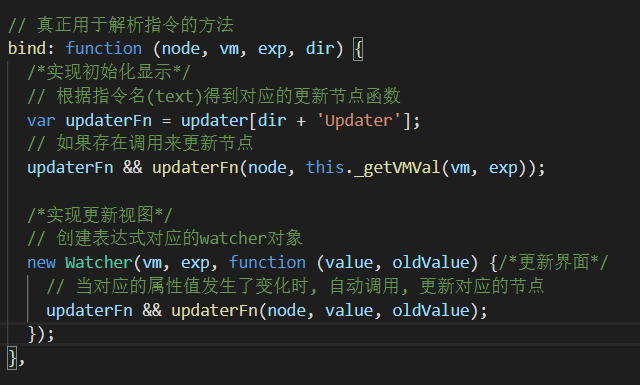

回想一下这个`bind`方法是什么时候调用的？就是在给每一个`Mustache`插值或者每一个一般指令编译的时候调用的，__也就是说这个`watcher`实例是跟每一个`Mustache`插值或者一般指令一一对应的__。并且把更新函数传入到`watcher`中，用于后面的更新页面。截至这里，我们在编译模板的时候，一方面会初始化页面，把数据渲染到页面上；另一方面我们会给模板中的插值或指令添加上对应的watcher实例，使每一个插值或指令都有唯一的一个watcher订阅者。

至此，在bind方法中创建watcher实例，就实现了下面这个过程了：

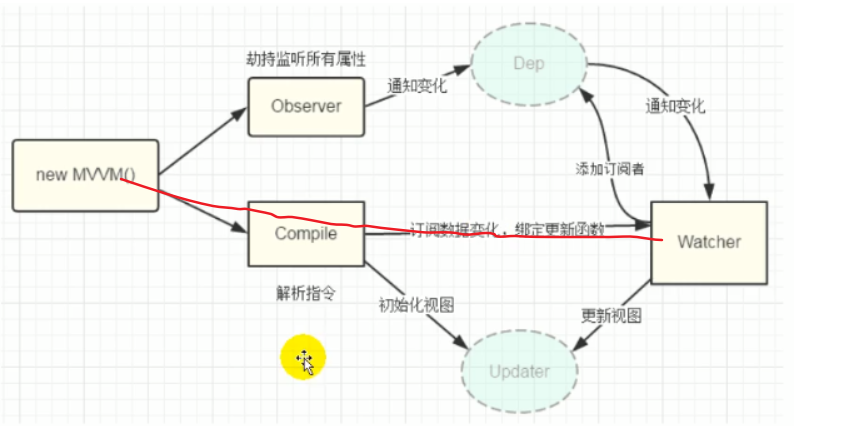

#### dep与watcher的关系

这里停一停，先理一下什么是dep，什么是watcher？

```
Dep
	它的实例是什么时候创建？
		初始化给data每个属性实现数据劫持时创建的
	个数？
		与data中每一层的每一个属性一一对应。拿上面的例子为例，一共有四个dep，分别是name对应的dep、wife对应的dep、wife对象中		  name对应的dep和wife对象中age对应的dep
	Dep的结构？
		id：每个dep实例唯一的标识
		subs：dep实例里面相关的n个watcher订阅者的容器
		
Watcher
	它的实例是什么时候创建？
		初始化解析大括号表达式和一般指令时创建的
	个数?
		与模板中大括号表达式或一般指令一一对应。
	Watcher的结构？
    	this.cb = cb;  // 用于更新界面的回调
  		this.vm = vm;  // vm实例
  		this.exp = exp;  // 对应的表达式
  		this.depIds = {};  // 相关的n个dep容器对象
  		this.value = this.get();  // 当前表达式对应的value
 
 Dep与Watcher之间的关系
 	什么关系？
 		dep是装着watcher的容器
 		多对多
 		data属性 -->1个Dep-->n个watcher（当模板中有多个表达式使用了该属性，n>1）
 		表达式 -->1个watcher-->n个Dep（多层表达式：{{a.b.c}}就一个watcher对应3个Dep）
 	如何建立关系？
 		data属性的get()方法中
 	何时建立？
 		初始化解析模板中的mustache表达式和一般指令创建watcher实例时
 	
  	vm.name = 'abc' -->data中的属性name值发生变化-->name的set()调用-->dep.notify()-->让dep中所有的订阅者更新
	
```

__注意数据劫持和编译模板的先后顺序。__我们在数据劫持的时候会设置属性的getter和setter，这些内部是为了收集依赖（建立dep与watcher关系）和通知更新，然后编译模板的时候，因为会读取到data的属性值，就肯定会触发这个属性的getter方法，从而进行依赖收集。那么我们肯定是先数据劫持，写好收集依赖的代码再去编译模板。由于dep在数据劫持中产生，而watcher是编译模板时产生，所以是先有dep再有watcher。


#### __dep和watcher是如何建立关系的？__

我们先看下，在初始化编译模板时，在解析到每个插值或者一般指令时都会创建一个watcher实例：

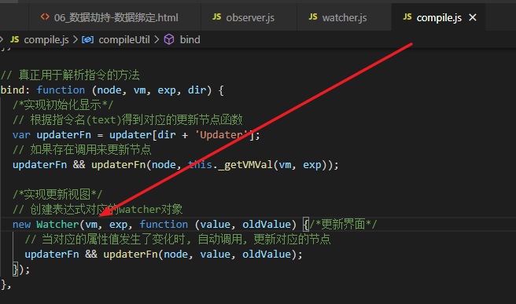

再进入watcher里面看看。这里主要是调用了`get()`方法，`get()`方法调用了`getVMVal()`方法，也就是读取插值或指令中的data中的属性，__此时就会触发这个属性的`get()`方法__


get()方法里面就是调用了`dep.depend()`：

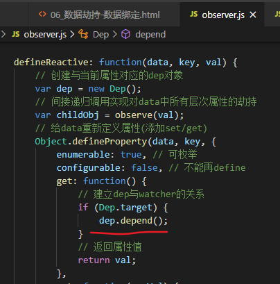

`depend()`方法是让watcher去调用`addDep()`：（注意我们在watcher中读取属性值之前已经设置了Dep.target，所以此时Dep.target就是watcher实例）


watcher的`addDep()`方法也很简单，就是给dep实例添加上该watcher，然后watcher自己也添加了dep：

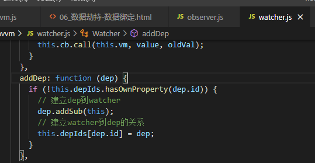

总的来说，从编译模板的时候有这么一个过程：

```
编译Mustache插值或指令 --> 创建对应的唯一的watcher实例 --> Watcher构造函数内部去读取插值或指令里面的data的属性值 --> 触发该属性的get()方法 --> get()方法就是让watcher添加到dep中，然后dep也添加到watcher中，形成一个多对多关系
```

__归根到底，data属性值的变化可以让页面中用到这个属性的地方发生变化，就是这个属性的dep与页面中插值或一般指令的watcher建立起了关系，然后变化时让dep通知里面所有watcher去更新页面__


#### 更新页面

当我们this.XXX = 'xxx'时就会触发这个XXX的`set()`方法，`set()`方法让`dep`里面所有订阅者`watcher`去调用自己的更新函数更新页面，这个更新函数其实在创建watcher实例的时候已经传进去watcher里面了。

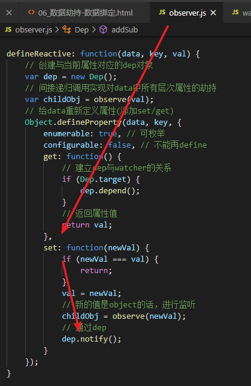

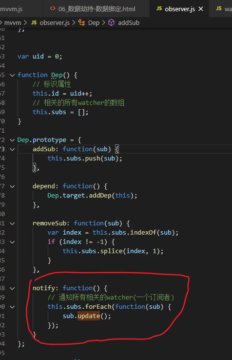

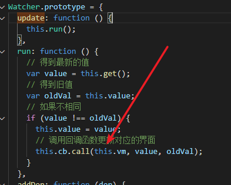


## 总结

1. 数据代理
   - 将vm._data代理给vm实例。这样做的目的是为了方便操作data中的数据，而不用通过vm.$options.data.xxx来操作一个数据。做法也很简单，就是通过Object.defineProperty()来给vm添加vm._data中的属性，get()方法中返回vm._data中对应的属性值，而set()方法设置的也是vm._data中属性值
2. 数据劫持
   - 数据劫持是Vue2中实现响应式数据的核心。通过Object.keys()来遍历data中的所有属性，然后通过递归的方式来遍历每一层的属性。然后用Object.defineProperty()来给这些属性添加get/set方法，get方法用于收集依赖，也就是给这个属性的dep添加订阅者watcher，而set方法用于派发更新，一旦数据发生变化，就会让这个变化了的属性对应的dep通知里面所有watcher更新页面。这里需要注意的是data中的属性跟dep是一一对应的，而模板中的插值或一般指令跟watcher是一一对应的。
3. 模板编译
   - 这一步是为了1、初始化页面 2、创建watcher，从而使dep与watcher建立关系。Vue之所以能实现响应式数据，是使用了数据劫持+发布订阅模式。那么数据劫持在上一步实现了，这里就实现发布订阅模式。这个发布订阅模式说白了就是把需要用到的值先存起来，到需要用到的时候就拿出来了。在初始化的时候，通过从el中递归地拿到模板中每层的childNodes放到文档碎片中，这样做是为了减少操作真实DOM，减少性能消耗，然后判断节点是文本节点还是元素节点，如果是文本节点，就判断是否是{{}}形式，然后拿到{{xxx}}中xxx在data中的值，替换到模板中；而如果是元素节点，就判断元素的属性有没有v-形式的属性且是不是一般指令（就是除了v-on），然后再从data中拿到这个指令的值的属性值，替换到模板中，这个过程中会创建与mustache插值或一般指令一一对应的watcher，并把更新函数传入到watcher中保存，给后面更新页面使用。而在watcher构造函数中，会读取这个mustache插值或一般指令中用到的data的属性，这么一读取就会触发这个属性get方法，从而使这个属性的dep与插值/指令的watcher建立起关系。一旦改变值，就会触发set方法让这个属性的dep通知里面所有watcher去更新页面

