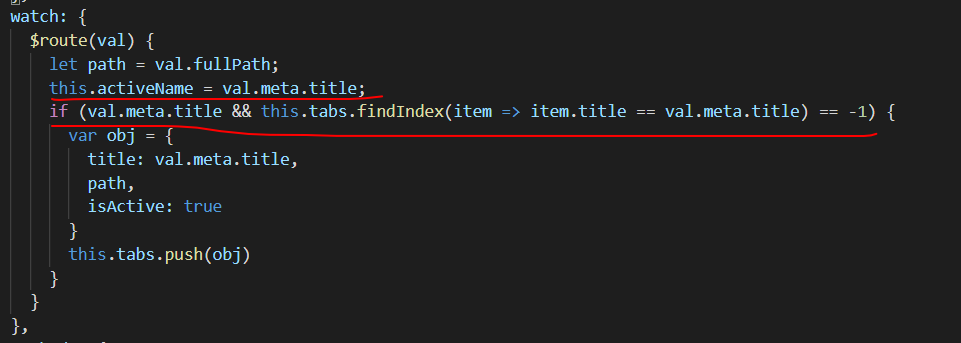

1、如何做简单的图片上传？

fileReader.readAsDataURL和URL.createObjectURL都可以创建图片地址，不同的是前者创建出来的图片地址是base64而且是异步的，而后者创建出来的图片地址是一个内存中的图片地址（blob）而且是同步的。_在项目中做简单的图片上传可以这样做：_将el-upload的自动上传设置为false，然后在事件before-upload的回调中，将参数file放进去URL.createObjectURL中，创建出来的内存图片地址存到一个数组中，并用于显示，最后点击提交的时候，再通过upload接口将该数组的图片上传倒服务器

2、那么是复杂的图片上传呢？又有拍照功能，又有图片上传功能

这种时候不要用el-upload自带的图片显示属性show-file-list，而是将所有图片放到一个数组中遍历显示，因为el-upload中的file-list文件列表是__只读__的，并不能操作，所以十分之不方便

3、vue中如何在一个没有绑定click事件的元素上阻止冒泡呢？

我们知道vue的事件修饰器.stop可以阻止冒泡，但是如果元素没有绑定click事件，又要阻止冒泡呢。比如元素用了@change，加上.stop，@change.stop，发现会报错，那么我们可以在元素上加多个@click.stop.native来阻止冒泡了。_应用场景_：elementui中的table，table中有个el-switch开关，我们触发el-switch的@change事件，但是不想触发选中行的回调，就可以用上面的方法，使点击开关的时候阻止冒泡

4、项目中导出excel是怎么实现的？

导出excel不是通过axios来实现的，是通过a标签的href和download来实现的。通过对a标签触发click事件来进行下载。先createElement来创建一个a标签，再设置href和download。其中href为后端给的下载excel的地址，一般是带参数的，如果参数是个数组，参数的形式是要这样的：sampleIds=1,2,3。而download则是下载下来的excel的名称

5、什么时候才能获取到$refs中的dom元素呢？

想通过$refs来获取子组件的data或者调用子组件的方法，一直报错can't not set property of undefined，打印发现this.$refs是一个空对象，这是为什么呢？因为只有当设置了ref=""属性的组件渲染完成之后才能通过this.$refs来获取，如果this.$refs为空对象，考虑是DOM节点还没生成

6、项目中一般用到的深拷贝的方法？

一个是通过JSON.parse(JSON.stringify())来实现深拷贝，这种方法好处是方便，但是JSON.stringify()序列化的时候会忽略__函数__和__undefined__，所以如果要拷贝的对象中有这两个数据类型，就要小心。

针对上面这个问题，如果对象中有函数或undefined的话，就要用递归来实现深拷贝了

7、代码中如何判断是否为开发环境，还是生产环境？

项目里面生产环境和开发环境的请求地址一般是不一样的，那么我们如果想设置不同的环境，请求地址的域名或者ip不一样，怎么设置呢？可以用process.env.NODE_ENV判断，如果是'development就是开发环境，否则是生产环境

8、如何写一个tabs显示不同内容的组件？

这种组件。

思路：

1、先说结构，这里的结构，左边的menu是elementui的el-menu，然后右边一整个是一个组件，上面是elementui的el-tabs组件，下面就是<router-link></router-link>了。

2、此时，我们就用正常的做法来使用el-menu来跳路由就好了。关键是上面的tabs是怎么添加的呢？我们知道，点击左边的el-menu是会跳路由的，也就是$route会发生变化，而在组件中，可以通过watch来监听$route的变化，从而获取到路由元信息，把这些信息放到一个数组中，上面tabs遍历的就是这个数组了，而activeName（也就是tabs组件当前高亮的tab）也在路由元信息中，为了不要重复的添加tab，在把元信息放到数组前，先通过findIndex来判断数组中是否已经有该信息。

此时，已经可以实现点击menu，tabs跟着高亮。下一步就是如何点击tab来切换路由了，这个也比较简单，就是点击的时候通过事件获取到tab的信息，然后通过$router来跳转路由，关键是这里分为三种情况：第一是如果是最后一个tab，删除之后路由要跳到前一个tab，第二是如果剩下一个tab，则跳回'/'，第三是其他情况一律往后一个tab跳。

